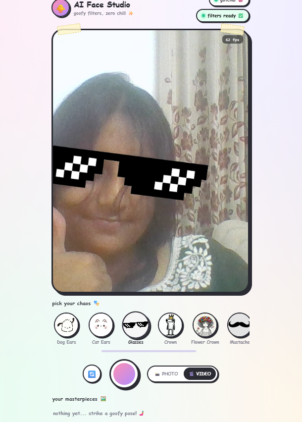
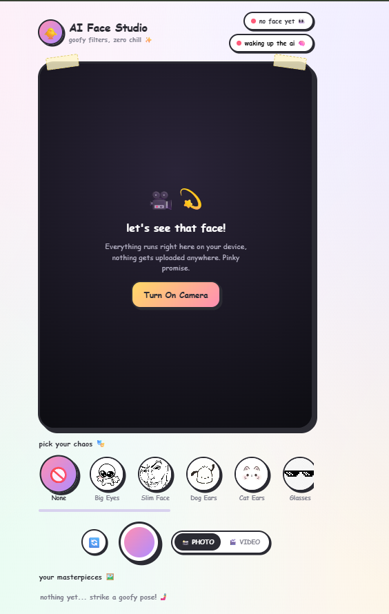
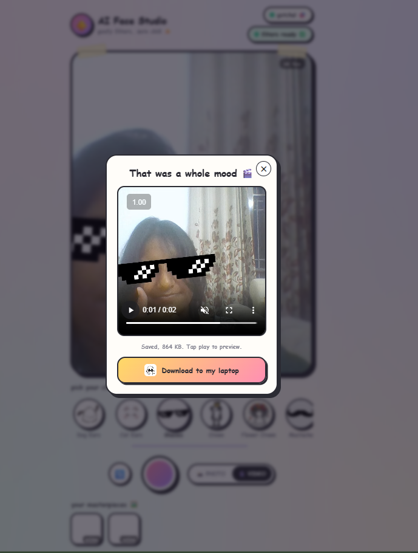
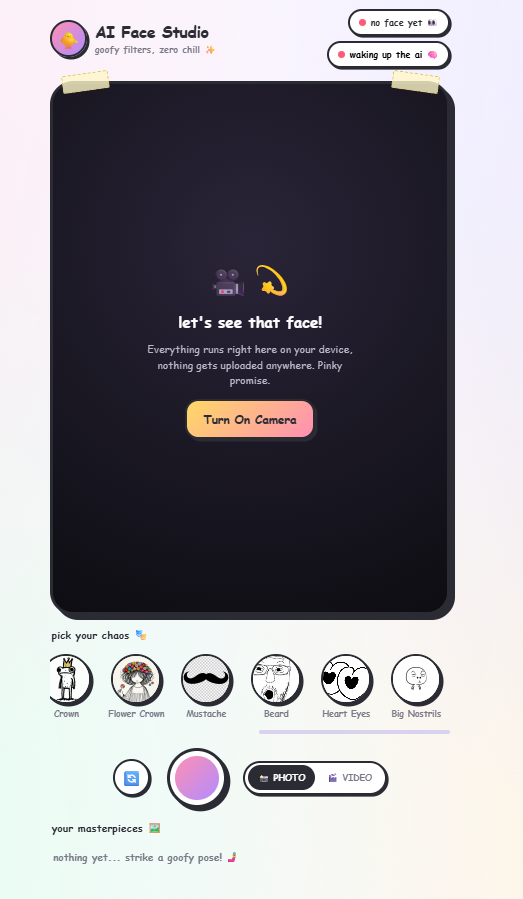

# AI Face Studio

Real time AR face filters that run entirely in the browser. Your face is tracked on device using a 468 point face mesh, no video or images are ever uploaded anywhere.
Kinda made a personlised snapchat!

Why??
 just for fun :)

## Live link - https://vishesharma20.github.io/augmented_filters/

## Screenshots

| Filter ready | Landing page |
|---|---|
|  |  |

| Live preview | Multiple filters |
|---|---|
|  |  |

## Features

- Real time face detection and landmark tracking, fully on device
- A growing set of filters: None, Big Eyes, Slim Face, Dog Ears, Cat Ears, Glasses, Crown, Flower Crown, Mustache, Beard, Heart Eyes, Big Nostrils
- Tap to switch filters instantly, camera never restarts
- Photo capture and video recording, both saved with the filter baked in
- Download button for every capture
- Goofy, doodle themed interface

## Getting started

This app needs to be served over a local address, not opened by double clicking the file, since browsers block a page opened that way from loading its own local AI model files.

**Option 1, VS Code:** install the Live Server extension, right click `index.html`, choose Open with Live Server.

**Option 2, Python:** open a terminal in this folder and run
```
python -m http.server
```
then visit `http://localhost:8000` in your browser.

Once it loads, allow camera access, wait for the badge near the top to say filters ready, then pick a filter from the row of icons and start recording.

## Project structure

```
index.html      main page
style.css       all styling
script.js       camera, face tracking, filter logic, capture and recording
lib/human.js    bundled face tracking library, no external CDN needed
models/         bundled AI model files used for face detection and mesh
assets/         filter icons and overlay images
screenshots/    images used in this README
```

## Adding a new filter

Every filter is one entry in the `FILTERS` object in `script.js`, with a name, an icon, and a `draw` function that receives the canvas context and the current face landmarks. Add a new entry there and it will automatically appear in the filter row, nothing else needs to change.
